# Tester la partition DMO

yrexpert-dmo est une partition de démonstration pour le système expert *yrexpert* de [Yrelay](http://www.yrelay.fr). Vous pourrez mettre en oeuvre cette partition de démonstration en mettant à jour **DMO** dans le paquet [**yrexpert-Terminal**](https://github.com/yrelay/yrexpert-Terminal).

* **Page d'accueil :** [github.com/yrelay/yrexpert-dmo](https://github.com/yrelay/yrexpert-dmo)
* **Documentation :** [Yrelay.github.io/yrexpert-dmo](https://Yrelay.github.io/yrexpert-dmo/)

## 1. Lancer yrexpert-Terminal

Lancer le fichier *yrexpert* :

	/opt/yrelay/yrexpert-terminal/scripts/yrexpert

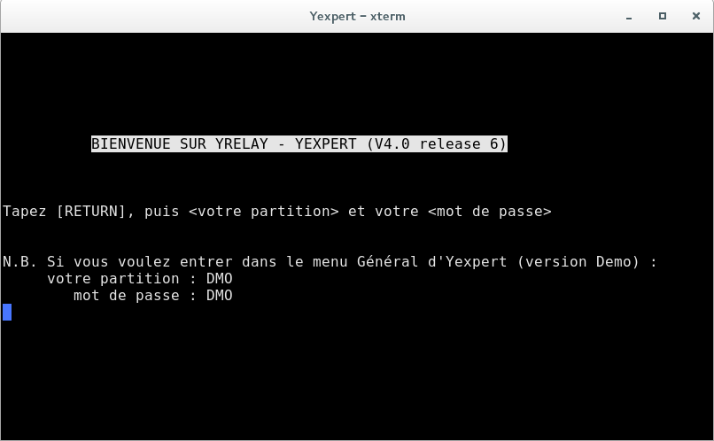

Suivre les instructions à l'écran.

## 2.1 Manipulations générales

Dans toutes les applications yrexpert, le dialogue entre l'utilisateur et le système s'effectue par
l'intermédiaire de commandes types et de touches de contrôle déplacements et sélection dans les
menus à options, saisie de données dans une grille, écriture de connaissances sous forme de règles,
etc.

Nous appelons « touche de contrôle » n'importe quelle touche du clavier tapée simultanément avec
la touche spéciale **CTRL**. Par exemple nous noterons **CTRL+F** pour indiquer que la touche
**F** est une touche de contrôle particulière.

Dans ce premier chapitre nous passons en revue toutes les commandes types et touches de contrôle
que vous rencontrerez lors d'une session de travail. Nous expliquons également l'utilisation des
« grilles de saisie » qui seront très utiles dans divers environnements.
Enfin, nous détaillons l'éditeur de règles de *DKBMS* que vous utiliserez pour rédiger du savoir-faire.

### 2.1.1. Commandes types et touches de contrôle

Voici la liste des commandes types. En général, il suffit de composer au clavier le caractère indiqué
pour déclencher l'effet de la commande, sans rajouter « entrée » (ou « Return »).

* **+** • Avancer d'une page.
* **-** • Reculer d'une page.
* **P** • Accéder directement à une page particulière.
* **↑** • Se déplacer vers le haut.
* **↓** • Se déplacer vers le bas.
* **→** • Se déplacer vers la droite.
* **←** • Se déplacer vers la gauche.
* **?** • « Que faire maintenant ? » Accéder directement à une information.
* **>** • Décaler d'une colonne vers la gauche.
* **<** • Décaler d'une colonne vers la droite.
* **R** • Afficher les objets de début et de fin de chaque page.
* **BACKSPACE** • Effacer le caractère précédent.
* **RETURN** • Fin de saisie du champ.
* **RETURN** • Continuer.
* **RETURN** • Sélectionner un objet dans une liste.
* **RETURN** • Valider une option d'un menu sélectionné.

On rappelle que pour composer la touche de contrôle **CTRL+F** (par exemple), il faut taper simultanément la touche **CTRL** et la touche **F**. Les signes **et** qui entourent **CTRL** et **F** ne sont pas à composer : ils sont un artifice de présentation.

* **CTRL+backslash** • Changer de mode d'affichage des attributs d'un individu.
* **CTRL+T** • les attributs de l'individu courant ou tous les attributs.
* **CTRL+A** • Abandonner l'action en cours, en renonçant à ses résultats.
* **CTRL+B** • Suivre un lien pour accéder aux attributs de l'individu désigné par le lien
* **CTRL+B** • Visualiser ou modifier le contenu d'un attribut spécial.
* **CTRL+B** • Changer de mode d'affichage : ordre selon les attributs ou selon les numéros d'ordre ou selon les valeurs des attributs.
* **CTRL+D** • Déposer le champ pris par **CTRL+P**. Donner une dénomination à une option (menus listes).
* **CTRL+D** • Changer de mode d'affichage : ordre selon les attributs ou selon les numéros d'ordre ou selon les valeurs des attributs.
* **CTRL+E** • Entrer dans une fenêtre (partie de l'écran)
• Visualiser ou modifier le contenu d'un attribut spécial.
* **CTRL+E** • Effacer tous les caractères à partir du caractère courant (Editeur)
* **CTRL+E** • Effacer tous les champs depuis le champ courant (Grilles de saisie)
P.
* **CTRL+F** • Finir l'action en cours en conservant ses résultats : c'est une des commandes les plus utilisées.
* **CTRL+G** • Effacer le champ courant
* "
* **CTRL+G** • Gommer : effacer les caractères de la ligne qui suivent le curseur (grilles de saisie, éditeur de règles)
* **CTRL+G** • Supprimer un attribut et sa valeur (se placer sur l'attribut)
* **CTRL+H** • Aide à l'utilisateur
* **CTRL+I** ou **Tab** • Passer en mode Insertion/modification (Editeur de règles et Grilles de saisie)
* **CTRL+J** • Imprimer sur impr i mante courante
* **CTRL+L** • Insérer une Ligne (Editeur de règles)
* **CTRL+L** • Changer de page (Abaques, menus libres)
* **CTRL+L** • Ajouter un attribut (affichage des attributs d'un individu)
* **CTRL+N** ou **CTRL+O** • Accéder directement à une option en donnant son NOM (menus listes)
* **CTRL+P** • Prendre un champ (Grilles de saisie)
Accéder directement à une option en donnant son NOM (menus listes)
* **CTRL+P** • Prendre une ligne (Editeur de règles)
* **CTRL+P** • Accéder à une page donnée (Affichage des attributs d'un individu)
* **CTRL+R** • Rafraîchissement de l'image écran (grilles de saisie, éditeur de règles)
* **CTRL+V** • Accéder aux attributs d'un lien.

## 2. Notions abordées dans cette démonstration

Cette démonstration (**DMO**) regroupe le savoir faire expert d'un botaniste lui permettant la reconnaissance des fleurs sauvages. Cette *démo* nous permettra d'aborder les notions suivantes :

### 2.1. Le lexique

Depuis le menu général suivre :
* 1 base de donnees et de connaissances dkbms
* 2 vocabulaire
* 1 lexique
* 2 consultation, modification, suppression
 * Taper **NOM**,
 * puis **CTRL+F**,
 * et **CTRL+A** pour sortir.

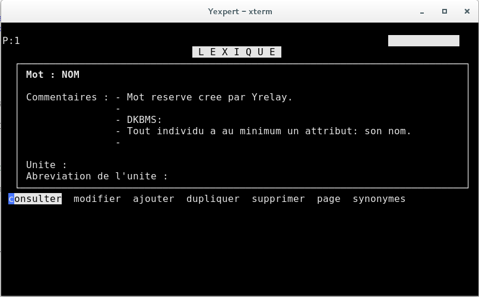

### 2.2. Le répertoire

Depuis le menu général suivre :
* 1 base de donnees et de connaissances dkbms
* 3 donnees
* 1 acces aux repertoires
 * Se déplacer avec **↑↓**,
 * puis **RETURN** pour entrer,
 * et **CTRL+A** pour sortir.

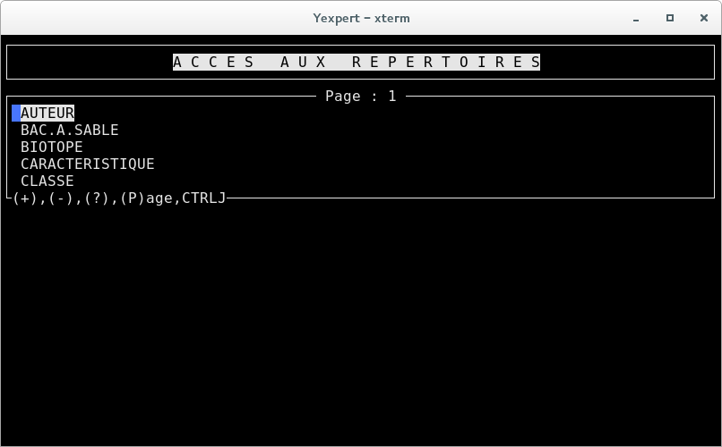

### 2.3. L'individu

Depuis le menu général suivre :
* 1 base de donnees et de connaissances dkbms
* 3 donnees
* 2 acces aux individus
 * Se déplacer sur les répertoires avec **↑↓**,
 * puis **RETURN** pour choisir un répertoire,
 * Se déplacer sur les individus avec **↑↓**,
 * puis **RETURN** pour choisir un individu,
 * et **CTRL+A** pour sortir.

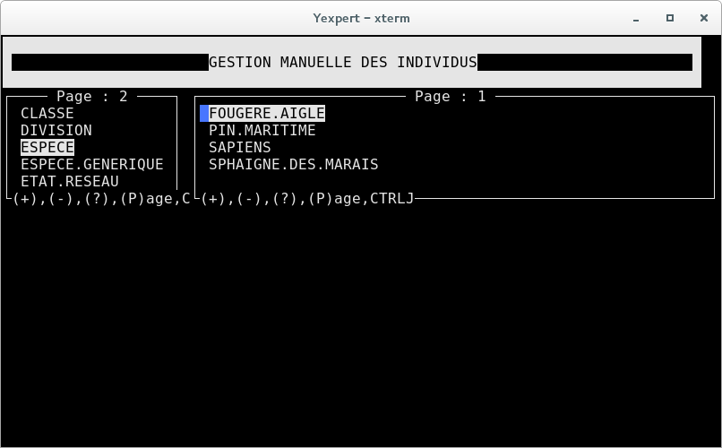

### 2.4. L'attribut

Depuis le menu général suivre :
* 1 base de donnees et de connaissances dkbms
* 3 donnees
* 4 acces aux attributs
 * Se déplacer sur les répertoires avec **↑↓**,
 * puis **RETURN** pour choisir un répertoire,
 * Se déplacer sur les individus avec **↑↓**,
 * puis **RETURN** pour choisir un individu,
 * Se déplacer sur les attributs avec **↑↓**,
 * puis **?** pour connaitre sa définition,
 * ou se mettre sur le nom du lien **←** et **CTRL+B** pour accéder à l'individu lié,
 * et **CTRL+A** pour sortir.

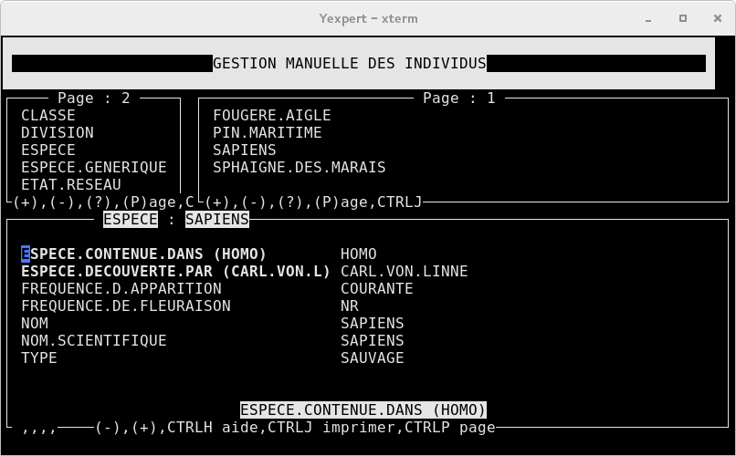

### 2.5. Le lien

Depuis le menu général suivre :
* 1 base de donnees et de connaissances dkbms
* 3 donnees
* 4 acces aux attributs
 * Se déplacer sur les répertoires avec **↑↓**,
 * puis **RETURN** pour choisir un répertoire,
 * Se déplacer sur les individus avec **↑↓**,
 * puis **RETURN** pour choisir un individu,
 * Se déplacer sur les attributs avec **↑↓**,
 * puis **?** pour connaitre sa définition,
 * ou se mettre sur le nom du lien **←** et **CTRL+V** pour accéder au lien,
 * et **CTRL+A** pour sortir.

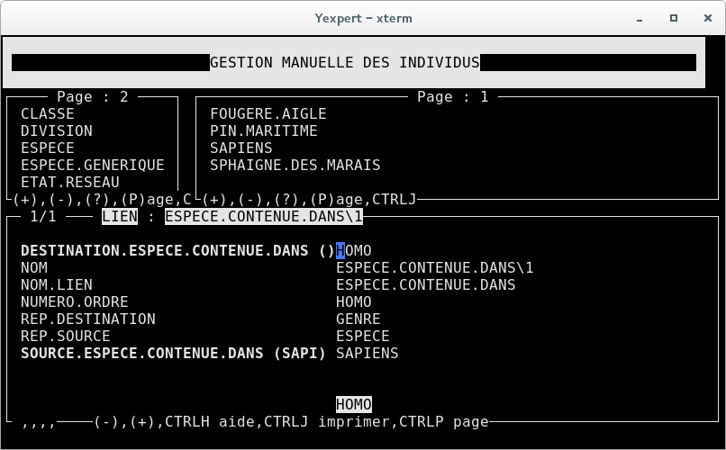

### 2.6. Le schéma de données

Depuis le menu général suivre :
* 1 base de donnees et de connaissances dkbms
* 3 donnees
* 3 visualisation arborescente des repertoires
 * Se déplacer sur les attributs avec **↑↓←→**,
 * Taper **CTRL+B** pour accéder à la liste des individus,
 * et **CTRL+A** pour sortir.

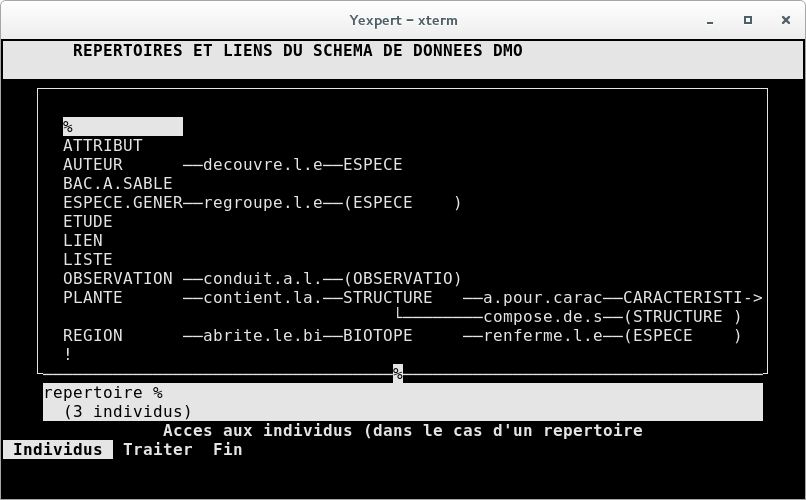

### 2.7. Léditeur en arbre

Depuis le menu général suivre :
* 1 base de donnees et de connaissances dkbms
* 4 liens & nomenclatures
* 4 editeur en arbre
 * Choisir **definition**,
   * Repertoire : STRUCTURE
   * Lien : COMPOSE.DE.STRUCTURE
   * Individu : **'*'** pour **Tous les individus**
    * Se déplacer sur les attributs avec **↑↓←→**,
    * Taper **CTRL+B** pour accéder à la liste des individus,
    * et **CTRL+A** pour sortir.

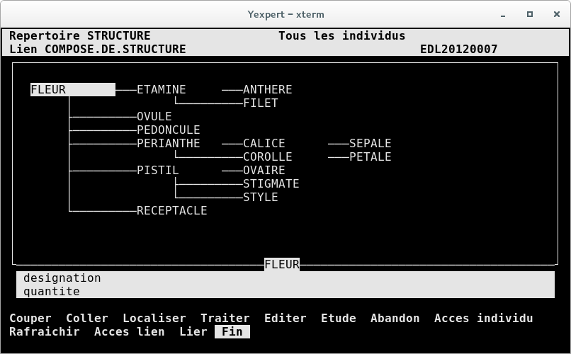

### 2.8. La liste

Depuis le menu général suivre :
* 1 base de donnees et de connaissances dkbms
* 5 listes & representations
* 1 acces aux listes
 * Choisir **lister**,
 * Se déplacer sur les listes **↑↓**,
 * Choisir une liste **RETURN**,
   * Liste d'attributs : **'*'**
   * Impression sur **ecran**
   * Taper **?** pour accéder à l'individu,
 * et **CTRL+A** pour sortir.

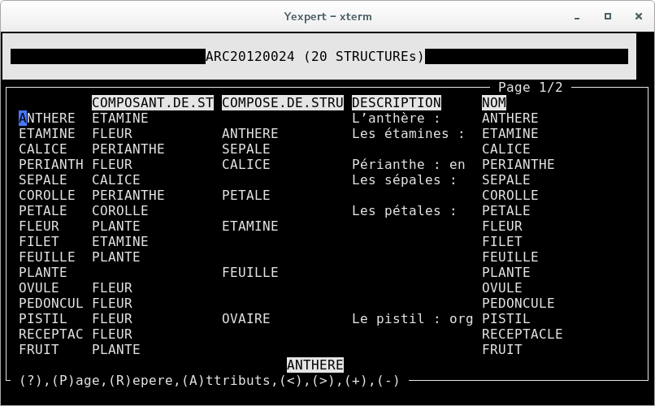

### 2.9. La requête

Depuis le menu général suivre :
* 1 base de donnees et de connaissances dkbms
* 6 requetes
 * Choisir **activer**, 
 * Se déplacer sur les listes **↑↓**,
 * Choisir une liste **RETURN**,
 * Requete deja activee, voulez vous recommencer ? :       **oui**
 * Liste de depart : **?**
 * Choisir la 1ere ligne
 * puis **RETURN**,
 * et **CTRL+A** pour sortir.

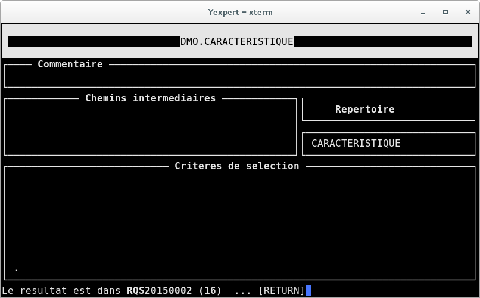

### 2.10. Le traitement

Depuis le menu général suivre :
* 1 base de donnees et de connaissances dkbms
* 7 connaissances
* 1 traitements
 * Choisir **activer**,
  * Traitement : ?
  * Choisir **DMO.COMPTEUR**
  * Se déplacer sur les listes **↑↓**,
   * Traitement en mode **reel**
 * et **CTRL+A** pour sortir.

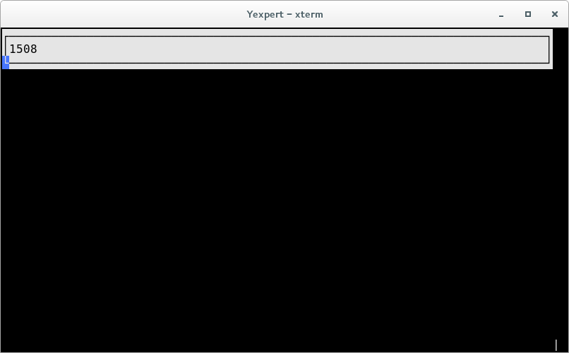

